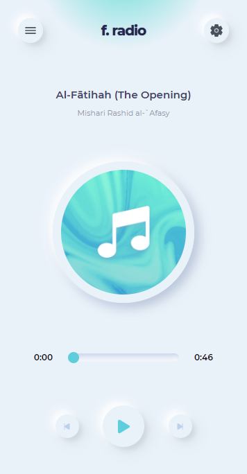

# Deeni Tube



This is the client-end repo of the deeni-tube app powered by [Deeni Info Tech](https://deeniinfotech.com/)

## Features

- Advertise less streaming service
- All features of youtube.com

## Tech

We use a number of open source projects to work properly:

- [React JS](https://reactjs.org/) - A JavaScript library for building user interfaces
- [Next JS](https://nextjs.org/) - The React Framework for Production
- [Ionic Framework](https://ionicframework.com/) and
- [Capacitor](https://capacitorjs.com/)

## Installation

It requires [Node.js](https://nodejs.org/) to run.

Install the dependencies and devDependencies and start the server.

```sh
cd deeni-tube-fe
npm i
npm run dev
```

For production environments...

```sh
npm install
npm run build
npm start
```

For Deploying to iOS and Android

```sh
npm install

npx cap add ios
npx cap add android

npm run build
npm run export
npx cap sync
npx cap copy

npx cap open ios
npx cap open android
```
